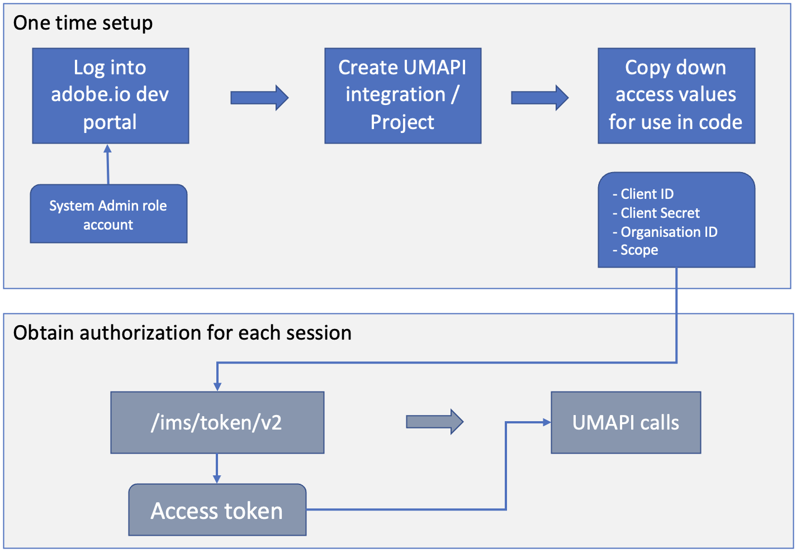
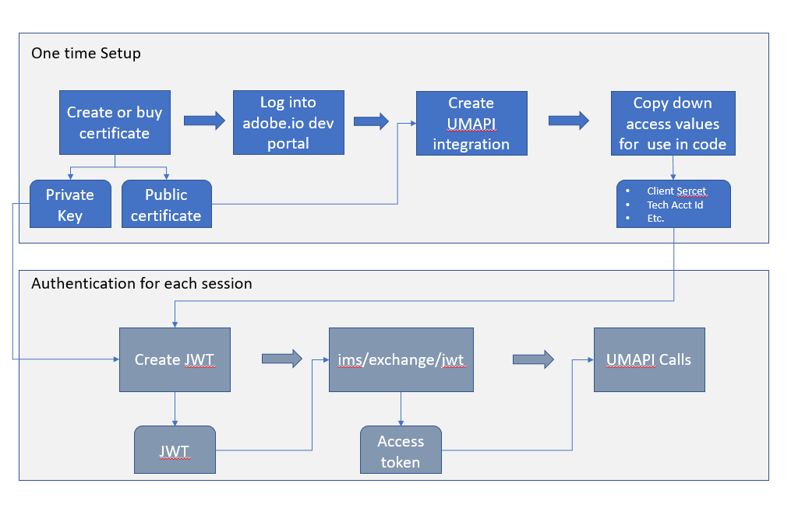

To maintain the security of your applications and users, all requests to Adobe I/O APIs must be authenticated and authorized. Before you can access the User Management API, you will need to obtain a set of credentials by creating a new Integration (Project) in the Adobe Developer Console.

## Using OAuth Server-to-Server credentials  

### One-time Setup  

To obtain the credentials needed to access the User Management service, create a **Project** using the [Adobe Developer Console](https://developer.adobe.com/).
* Only members of the organization with SYSTEM ADMIN role can create the Integration for UMAPI. You can use the Adobe Admin Console to grant the administrative privilege to users.
* Your integration provides an API key that uniquely identifies your client, and other credentials that you need to access the UM API.
* See [User Management Walkthrough.](samples/index.md) for Python samples that demo the use of UMAPI.

### Authorizing API calls

Obtain an access token by calling the Adobe's IMS endpoint using your Client ID and Client Secret (from the OAuth Server-to-Server enabled project on developer portal), along with the grant type and scope parameters.

Sample curl command:
```bash
curl -L -X POST 'https://ims-na1.adobelogin.com/ims/token/v2?grant_type=client_credentials&client_id=CLIENT_ID&client_secret=CLIENT_SECRET&scope=openid,AdobeID,user_management_sdk'
```  

Use the obtained access token in the Authorization header of all your other UMAPI calls along with the x-api-key header:
* **Authorization** : Bearer [access token]
* **x-api-key** : your Client ID  

The access token has 24 hours validity.  

For complete details on OAuth Server-to-Server, see [OAuth Server-to-Server credential implementation guide](https://developer.adobe.com/developer-console/docs/guides/authentication/ServerToServerAuthentication/implementation/).  

Here's the simplified diagram of the OAuth Server-to-Server workflow:

  
  
## Using JWT credentials - DEPRECATED  

### One-time Setup  

To obtain the credentials you need to access the User Management service, create a **Service Account Integration** using the [Adobe I/O Console](https://developer.adobe.com/).

* A member of the organization with SYSEM ADMIN rights can create the Integration. You can use the Admin Console to grant administrative privilege to users.
* You will need to create or purchase a digital signing certification, and use it to sign a JSON Web Token (JWT), which you will use to exchange it for an access token on Adobe IMS side
* Your integration provides an API key that uniquely identifies your client, and other credentials that you need to access the UM API.

For complete details on JWT, see [Service Account (JWT) Authentication](https://developer.adobe.com/developer-console/docs/guides/authentication/JWT/).

### Authorizing API calls

To establish a secure service-to-service API session, you will create a JSON Web Token (JWT) that encapsulates your client credentials, and sign the JWT with the private key for a public-key certificate associated with the integration. 

You will exchange the JWT for an access token from the Adobe Identity Management Service (IMS). Every request to an Adobe service must include the access token in the **Authorization** HTTP header, along with the API Key (client  ID) that was generated when you created the integration. Include these headers in all requests:

* **Authorization** : A current access token obtained from the login request.
* **x-api-key** : The API key for your integration.  

We recommend that you store your API client credentials and private key with strong protection, but that you do NOT store a JWT or access token. You should create a new JWT for each user-management session, and use it to obtain an access token for that session.

To initiate each user-management session, create and send a JSON Web Token to Adobe in an access request. Include your JWT in a POST request to the Adobe Identity Management Service (IMS):
```
https://ims-na1.adobelogin.com/ims/exchange/jwt/
```
Pass the signed, base-64 encoded JWT as the value of the URL-encoded **jwt_token** parameter in the body of the POST request.

The response contains an access token that is valid for 24 hours after it is issued. Pass this token in the **Authorization** header in all subsequent requests to the User Management API.

You can request multiple access tokens. Previous tokens are not invalidated when a new one is issued. You can authorize requests with any valid access token. This allows you to overlap access tokens to ensure your integration is always able to connect to Adobe.

* For complete details, see [Creating a JSON Web Token](https://developer.adobe.com/developer-console/docs/guides/authentication/JWT/).
* For an example of a script that creates a JWT and makes a log-in call, see `JWTExchange.py` [here](samples/samples-old/)  

Here's the simplified diagram of the OAuth Server-toServer workflow:
  

  
