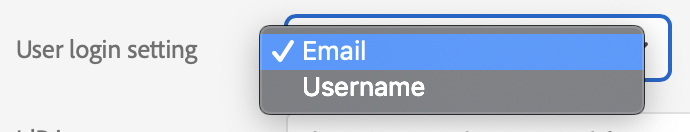

# User Management Action Commands

The JSON _commands_ structure contained in your POST request to the `action` endpoint specifies a sequence of commands. Each command entry specifies a user or a [user group](glossary.md#usergroup) and a sequence of _steps_ to be performed for that user or user group.

For a given command entry, the API attempts to perform the steps in the order that they appear. However, the order of execution of commands is not always guaranteed. If the same user or user group is listed in more than one command, results could differ depending on the order of command execution. Use the following order as guidance:

* Creates ([addAdobeId](ActionsCmds.md#addAdobeID), [createEnterpriseID](ActionsCmds.md#createEnterpriseID), [createFederatedID](ActionsCmds.md#createFederatedID)).
* [Create](usergroupActionCommands.md#createUserGroup) a new user group
* [Update](usergroupActionCommands.md#updateUserGroup) an existing user group
* [Delete](usergroupActionCommands.md#deleteUserGroup) a user group
* [Updates](ActionsCmds.md#update) of users' information.
* [Removal](ActionsCmds.md#remove) of entitlements and memberships.
* [Adding](ActionsCmds.md#add) of entitlements and memberships
* [Removal](ActionsCmds.md#removeFromOrg) of users from an organization
 
******

# <a name="actionRequestBodyProperties" class="api-ref-subtitle">Command entries</a>

Each _command_ entry begins with a _root command_ that specifies whether a set of actions applies to an individual user, or to a user group. The JSON commands structure allows a maximum of 10 users or user groups to be operated on per request.

## Root commands

<a name="userRootCommand" class="api-ref-subtitle">__user:__</a> _string_
The user field is usually an email address with a UID and domain component `jdoe@example.com`. Organizations can be configured to accept usernames that are not email addresses. In these cases, the `domain` property must be provided in order to identify the user. [Identity Types](glossary.md#identity) explains the different account types available. 

<a name="usergroupRootCommand" class="api-ref-subtitle">__usergroup:__</a> _string_
To create, update or delete a [user group](glossary.md#usergroup), specify `createUserGroup`, `deleteUserGroup`, and `updateUserGroup` actions in the `do` list for the `usergroup`. To update the membership list specify `add` and `remove` actions in the `do` list for the `usergroup`. See [User Group Action Commands](usergroupActionCommands.md) for details.

__do:__
Each root command has a single `do` entry. Within a command's `do` entry, a set of _step actions_ specify what management operations to perform for the root user or user group.

<hr class="api-ref-rule">

## Step actions for users

This section describes step actions that can be performed for a [user](#userRootCommand). For steps that can be performed for a [user group](#usergroupRootCommand), see [User Group Action Commands](usergroupActionCommands.md).

The following properties apply to a [user](#userRootCommand):

__requestID:__ _string_
Arbitrary string to be returned in the response payload. This is to help identify the response that corresponds to a particular command entry.

__domain:__ _string_
[Federated IDs](glossary.md#federatedId) that are not email addresses, must supply the domain the user belongs to in order to identify the user. This is required for all operations; create, update, add, remove, and removeFromOrg.
The domain field must be at the same level as the user field. The domain field is ignored if the user has an [Adobe](glossary.md#adobeId) or [Enterprise](glossary.md#enterpriseId) ID. [Identity Types](glossary.md#identity) explains the different account types available.

__useAdobeID:__ _boolean_
When true, the user ID is interpreted to refer to an existing [Adobe ID](glossary.md#adobeId) even if a [Enterprise](glossary.md#enterpriseId) or [Federated ID](glossary.md#federatedId) exists with the same name.

__do:__
Lists the series of _steps_ to complete for this command entry. For a single user command entry, there can be only __one__ create user operation ([createEnterpriseID](#createEnterpriseID), [createFederatedID](#createFederatedID) or [addAdobeID](#addAdobeID)) and __one__ delete user operation ([removeFromOrg](#removeFromOrg)).

<hr class="api-ref-rule">  

## <a name="emailVsUsername">Username vs Email user login setting</a>

Based on the Admin Console -> Settings -> Identity -> a Directory's metadata, there can be 2 situations for `User login setting`:  

  

Based on this setting, the [user](#userRootCommand) actions will differ in the JSON body format. Use-cases in this page will reference one or the other as __email based login__ or __username based login__.

<hr class="api-ref-rule">  

### <a name="addAdobeID" class="api-ref-subtitle">__addAdobeID:__</a>
Adds a user who has an existing [Adobe ID](glossary.md#adobeId). User-information fields such as `firstname` and `lastname` can be included.

>Previously, when an Adobe ID user was added, the user would receive an email inviting them to join the organization.

See [user-information](#user-information) for individual field descriptions.
```
{
  "addAdobeID": {
    "email": "string",
    "country": "string",
    "firstname": "string",
    "lastname": "string",
    "option": "string"
  }        
}
```
Usage:  

```
[{
  "user" : "jdoe@domain1.com",
  "requestID": "action_1",
  "do" : [{
    "addAdobeID": {
      "email": "jdoe@domain1.com",
      "country": "US",
      "firstname": "John",
      "lastname": "Doe",
      "option": "ignoreIfAlreadyExists"
    }
  }]
}]
```

### <a name="createEnterpriseID" class="api-ref-subtitle">__createEnterpriseID:__</a>
Creates an [Enterprise ID](glossary.md#enterpriseId). See [user-information](#user-information) for individual field descriptions.
```
{
  "createEnterpriseID": {  
    "email": "string",
    "country": "string",
    "email": "string",
    "country": "string",
    "option": "string"
  }
}
```
Usage:  

```
[{
  "user" : "jdoe@claimed-domain1.com",
  "requestID": "action_1",
  "do" : [{
    "createEnterpriseID": {
      "email": "jdoe@dclaimed-domain1.com",
      "country": "US",
      "firstname": "John",
      "lastname": "Doe",
      "option": "ignoreIfAlreadyExists"
    }
  }]
}]
```

### <a name="createFederatedID" class="api-ref-subtitle">__createFederatedID:__</a>
Creates a [Federated ID](glossary.md#federatedId). See [user-information](#user-information) for individual field descriptions.  
```
{
  "createFederatedID": {
    "email": "string",
    "country": "string",
    "firstname": "string",
    "lastname": "string",
    "option": "string"
  }
}
```
Sample POST body for [email based login](ActionsCmds.md#emailVsUsername): 

```
[{
  "user" : "jdoe@claimed-domain1.com",
  "requestID": "action_1",
  "do" : [{
    "createFederatedID": {
      "email": "jdoe@claimed-domain1.com",
      "country": "US",
      "firstname": "John",
      "lastname": "Doe",
      "option": "ignoreIfAlreadyExists"
    }
  }]
}]
```
Sample POST body for [username based login](ActionsCmds.md#emailVsUsername):  

```
[{
  "user" : "jdoe,
  "domain": "claimed-domain1.com",
  "requestID": "action_1",
  "do" : [{
    "createFederatedID": {
      "email": "jdoe@claimed-domain1.com",
      "country": "US",
      "firstname": "John",
      "lastname": "Doe",
      "option": "ignoreIfAlreadyExists"
    }
  }]
}]
```
### <a name="user-information" class="api-ref-subtitle">__User Information Fields__</a>
* __firstname:__ _string_; Limited to 250 characters. Required for `createEnterpriseID` and `createFederatedID`. Optional for `addAdobeID`.
* __lastname:__ _string_; Limited to 250 characters. Required for `createEnterpriseID` and `createFederatedID`. Optional for `addAdobeID`.
* __email:__ _string_; A valid email address. Required for `createEnterpriseID`, `addAdobeID` and `createFederatedID`. Limited to 60 characters.
* __country:__ _string_; A valid ISO 2 upper-case characters country code. Optional for `createEnterpriseID` and `addAdobeID`. Required for `createFederatedID`. The `country` value cannot be updated after it is set.
* __option:__ _string_, possible values: `{ignoreIfAlreadyExists, updateIfAlreadyExists}`; In addition to the new user's field values, the parameters can include an _option_ flag that specifies how to perform the create operation when a user with the given ID already exists in the user database. Default behaviour is `ignoreIfAlreadyExists`. Optional property for `createEnterpriseID`, `createFederatedID`, `addAdobeID`. It only affects first name and last name metadata.
  - `ignoreIfAlreadyExists`: If the ID already exists, ignore the _create_ step but process any other steps in the command entry for this user.
  - `updateIfAlreadyExists`: If the ID already exists, perform an _update_ action using the parameters in the create step. After updating all fields present in the step, process any other steps in the command entry for this user.

### <a name="update" class="api-ref-subtitle">__update:__</a>
The `update` action writes new personal information to the user's account details. You can update [Enterprise](glossary.md#enterpriseId) and [Federated IDs](glossary.md#federatedId) that are managed by your organization. 
* Independent [Adobe IDs](glossary.md#adobeId) are managed by the individual user and cannot be updated through the User Management API. Attempting to update information for a user who has an [Adobe ID](glossary.md#adobeId) will result in an error: [error.update.adobeid.no](ErrorRef.md#adobeidno).
* For Federated IDs, the `update` request can only change the information that is stored by Adobe. You cannot use the User Management API to change information your organization stores outside of Adobe.
* [Identity Types](glossary.md#identity) explains the different account types available. See [user-information](#user-information) for individual field descriptions.

The parameters of an update step specify the changed fields and their new values. If you do not specify a field, its value remains unchanged.  

Inside _update_ parameters that need an update should appear.  

```json
{
  "update": {
    "email": "string",
    "firstname": "string",
    "lastname": "string",
    "username": "string"
  }
}
```  
Note: _country_ is not updatable via the UMAPI  

Samples for _update_ use-case scenarios - [email based login](ActionsCmds.md#emailVsUsername):  

* Updating user's _Email_ and _Last Name_ metadata but keeping the domain part constant
```json
[{
  "user": "jdoe@claimed-domain1.com",
  "requestID": "action_1",
  "do": [{
    "update": {
      "email": "jnew@claimed-domain1.com",
      "lastname": "new"
    }
  }]
}]
```

* Updating user's _Email_ metadata but also chnage the domain part  
>__Requirement__: used domains should be claimed and added to same Admin Console Directory  
```json
[{
  "user": "jdoe@claimed-domain1.com",
  "requestID": "action_1",
  "do": [{
    "update": {
      "email": "jdoe@claimed-domain2.com"
    }
  }]
}]
``` 

* Updating user's _Username_ metadata but use a different domain than the _Email_ for it  
>__Requirement__: used domains should be claimed and added to same Admin Console Directory  
```json
[{
  "user": "jdoe@claimed-domain1.com",
  "requestID": "action_1",
  "do": [{
    "update": {
      "username": "jdoe@claimed-domain2.com"
    }
  }]
}]
```

* Updating user's _Username_ and _Email_ metadata using new different domains for each  
>__Requirement__: used domains should be claimed and added to same Admin Console Directory  
```json
[{
  "user": "jdoe@claimed-domain1.com",
  "requestID": "action_1",
  "do": [{
    "update": {
      "email": "canBeNew@claimed-domain2.com",
      "username": "canBeOther@claimed-domain3.com",
    }
  }]
}]
```  


Samples for _update_ use-case scenarios - _update_ use-case scenarios for [username based login](ActionsCmds.md#emailVsUsername):  

* Updating user's _Email_ and _Last Name_ metadata, using same domain for the new email as we had for the old one  
```json
[{
  "user": "jdoe",
  "domain": "claimed-domain1.com",
  "requestID": "action_1",
  "do": [{
    "update": {
      "email": "jnew@claimed-domain1.com",
      "lastname": "new"
    }
  }]
}]
```  

* Updating user's _Email_ metadata but change domain as well  
>__Requirement__: used domain should be claimed and added to same Admin Console Directory 
```json
[{
  "user": "jdoe",
  "domain": "claimed-domain1.com",
  "requestID": "action_1",
  "do": [{
    "update": {
      "email": "new@claimed-domain2.com"
    }
  }]
}]
```  

* Updating only user's _Username_ metadata  
```json
[{
  "user": "jdoe",
  "domain": "claimed-domain1.com",
  "requestID": "action_1",
  "do": [{
    "update": {
      "username": "jnew"
    }
  }]
}]
```

#### Updating Email and Username policy

For all account types, the email address is used as a case-sensitive unique identifier. You __cannot__ use the `update` request to __change the letter case of the email address__, once it has been set. There is an additional `username` field: for Adobe IDs and Enterprise IDs, the `username` is always the same as the email address, and the same is true by default for Federated IDs. 

For Federated IDs, you can update the `username` field for users whose email address is in your domain. The `username` value can also be an email address, but you can never use it to identify a user in requests.

In case of [email based login](ActionsCmds.md#emailVsUsername), if you use an `update` command to change an user's Email metadata, the Username metadata __is automatically updated to match__, provided that all domains being used in the request are claimed. 

```json
[{
  "user": "jdoe@claimed-domain1.com",
    "do": [{
      "update": {
        "email": "jdoe@claimed-domain2.com"
      }
    }]
}]
```  
After the above change, user's Username and Email values in Admin Console will be equal to `jdoe@claimed-domain2.com`  


### <a name="add" class="api-ref-subtitle">__add:__</a>
Adds a user as a member of a group. You can add a maximum of 10 memberships in one command entry. See [Add/Remove Attributes](#addRemoveAttr) section for full details of the `group` attribute.

```json
{
  "add": {
    "group": [
      "group_name"
    ]
  }
}
```  

Sample JSON body for [email based login](ActionsCmds.md#emailVsUsername):   

```json
[{
  "user": "jdoe@claimed-domain1.com",
  "requestID": "action_1",
  "do": [{
    "add": {
      "group": [ 
        "group_name1", 
        "group_name2"
      ]
    }
  }]
}]
```  

Sample JSON body for [username based login](ActionsCmds.md#emailVsUsername):   

```json
[{
  "user": "jdoe",
  "domain": "claimed-domain1.com",
  "requestID": "action_1",
  "do": [{
    "add": {
      "group": [ 
        "group_name"
      ]
    }
  }]
}]
```  


### <a name="remove" class="api-ref-subtitle">__remove:__</a>
Removes the membership of users from groups. You can remove a maximum of 10 memberships in one command entry, unless you use the special  "all" parameter to remove all memberships for the user. See [Add/Remove attributes](#addRemoveAttr) section for full details of the `group` attribute.

```json
{
  "remove" : {
    "group": [
      "group_name"
    ]
  }
}
```
Additionally you can pass the attribute `all` to remove the user from all groups including product profiles, user-groups, and administrative groups (admin roles):
```json
{
  "remove" : "all"
}
```

Sample JSON body for [email based login](ActionsCmds.md#emailVsUsername):   

* removing an user's membership from 2 groups 
```json
[{
  "user": "jdoe@claimed-domain1.com",
  "requestID": "action_1",
  "do": [{
    "remove": {
      "group": [ 
        "group_name1", 
        "group_name2"
      ]
    }
  }]
}]
```  

* remove the user account from all Groups/PLCs/Admin roles in Admin Console 
* org_admin (System Admin) role can't be removed via UM API
```json
[{
  "user": "jdoe@claimed-domain1.com",
  "requestID": "action_1",
  "do": [{
    "remove": "all"
  }]
}]
```  

Sample JSON body for  [username based login](ActionsCmds.md#emailVsUsername):   

* removing an user's membership from a group/PLC  
```json
[{
  "user": "jdoe",
  "domain": "claimed-domain1.com",
  "requestID": "action_1",
  "do": [{
    "add": {
      "remove": [ 
        "group_name1"
      ]
    }
  }]
}]
```  

* remove the user account from all Groups/PLCs/Admin roles in Admin Console  
```json
[{
  "user": "jdoe",
  "domain": "claimed-domain1.com",
  "requestID": "action_1",
  "do": [{
    "remove": "all"
  }]
}]
```  

### <a name="addRemoveAttr" class="api-ref-subtitle">__Add/Remove Attributes__</a>

The following attribute is available in both the [add](#add) and [remove](#remove) operations for a user:

* __group:__ A list of [product profile groups](glossary.md#productprofile), [user groups](glossary.md#usergroup), or administrative groups with a maximum of 10 entries. 

Add or remove membership in user groups and product profiles to control entitlements. Product profiles correspond to specific product access rights, so adding product access for a user is the same as adding that user to the corresponding product profile.

Add or remove membership in administrative groups to control administrative rights. There are three groups with fixed names corresponding to administrative roles:
 * Administrators: `_org_admin` 
 * Support Administrators: `_support_admin` 
 * Deployment Administrators: `_deployment_admin` 

In addition, there are administrative groups for each user group and product profile. 
  * An administrative group for a product is named with the prefix `_product_admin_` and the product name. For example, `_product_admin_Photoshop`.  
  * An administrative group for a product profile or user group is named with the prefix `_admin_` and the product-profile or user-group name. For example, `_admin_MarketingProfile` or `_admin_PhotoshopUserGroup`.  
  * A developer group for a product profile is named with the prefix `_developer_` and the product-profile name. For example `_developer_MarketingProfile`.

Use the [`group`](group.md) resource to retrieve information about defined groups.

### <a name="removeFromOrg" class="api-ref-subtitle">__removeFromOrg:__</a>

Removes the user's membership in the organization, and optionally from membership in a domain that is linked to the given organization through the trusted-domain relationship. This includes any product configs and user-groups in the organization that they are a member of. There can only be a single `removeFromOrg` action in a command entry. If present, the removal action will be the last step invoked. If the user is specified by email address, then the domain of the email address specifies the domain of the account. If the user is specified by Username, the domain must be provided.

Note that the response always reports a successful result for this action, even if the user did not exist.

```json
{
  "removeFromOrg": {
    "deleteAccount": boolean
  }
}
```

* __deleteAccount:__ _boolean_; If true then if the account is owned by the organization, the account is also deleted. Note that [Adobe IDs](glossary.md#adobeId) are never deleted because they are owned by the user, not the organization. The default value is false.  

Corresponding Admin Console actions:  
`"deleteAccount": false` = removing the user from the __Users__ menu 
`"deleteAccount": true` = removing the user from the __Directory users__ menu; implies loss of account metadata and associated cloud assets  

Sample JSON body for  [email based login](ActionsCmds.md#emailVsUsername):   

```json
[{
  "user": "jdoe@claimed-domain1.com",
  "requestID": "action_1",
  "do": [{
    "removeFromOrg": {
      "deleteAccount": false
    }
  }]
}]
```  

Sample JSON body for  [username based login](ActionsCmds.md#emailVsUsername):   
```json
[{
  "user": "jdoe",
  "domain": "claimed-domain1.com",
  "requestID": "action_1",
  "do": [{
    "removeFromOrg": {
      "deleteAccount": false
    }
  }]
}]
``` 

<hr class="api-ref-rule">

### <a name="userExamples" class="api-ref-subtitle">User command request body schema for [email based login](ActionsCmds.md#emailVsUsername) scenario</a>
```json
[{
  "user": "string",
  "requestID": "string",
  "useAdobeID": boolean,
  "do": [
    {
      "addAdobeID": {
        "country": "string",
        "email": "string",
        "firstname": "string",
        "lastname": "string",
        "option": "string"
      }
    },
    {
      "createEnterpriseID": {
        "country": "string",
        "email": "string",
        "firstname": "string",
        "lastname": "string",
        "option": "string"
      }
    },
    {
      "createFederatedID": {
        "country": "string",
        "email": "string",
        "firstname": "string",
        "lastname": "string",
        "option": "string"
       }
    },
    {
      "add": {
        "group": [
          "string"
        ]
      }
    },
    {
      "remove": {
        "group": [
          "string"
        ]
      }
    },
    {
      "removeFromOrg": {
        "deleteAccount": boolean
      }
    },
    {
      "update": {
        "email": "string",
        "firstname": "string",
        "lastname": "string"
      }
    }
  ]
}]
```  

### <a name="userExamples" class="api-ref-subtitle">User command request body schema for [username based login](ActionsCmds.md#emailVsUsername) scenario</a>
```json
[{
  "user": "string",
  "domain": "string",
  "requestID": "string",
  "useAdobeID": boolean,
  "do": [
    {
      "addAdobeID": {
        "country": "string",
        "email": "string",
        "firstname": "string",
        "lastname": "string",
        "option": "string"
      }
    },
    {
      "createEnterpriseID": {
        "country": "string",
        "email": "string",
        "firstname": "string",
        "lastname": "string",
        "option": "string"
      }
    },
    {
      "createFederatedID": {
        "country": "string",
        "email": "string",
        "firstname": "string",
        "lastname": "string",
        "option": "string"
       }
    },
    {
      "add": {
        "group": [
          "string"
        ]
      }
    },
    {
      "remove": {
        "group": [
          "string"
        ]
      }
    },
    {
      "removeFromOrg": {
        "deleteAccount": boolean
      }
    },
    {
      "update": {
        "email": "string",
        "firstname": "string",
        "lastname": "string"
      }
    }
  ]
}]
```  

<hr class="api-ref-rule">

## Some other action examples  

* Mix of creating a [Federated ID](glossary.md#federatedId) and add the user to the Product License Configurations `Photoshop - 2Gb` and `Illustrator - 20Gb` actions  
```json
[{
  "user" : "jdoe@claimed-domain1.com",
  "requestID" : "ed2148",
  "do" : [
    {
      "createFederatedID": {
        "email": "jdoe@claimed-domain1.com",
        "country": "US",
        "firstname": "John",
        "lastname": "Doe"
      }
    },
    {
      "add" : {
        "group" : [ "Photoshop - 2Gb", "Illustrator - 20Gb"]
      }
    }
  ]
}]
```  

* Mix of creating a [Federated ID](glossary.md#federatedId) and updating the username metadata actions:  
```json
[{
  "user" : "jdoe@claimed-domain1.com",
  "requestID" : "ed2149",
  "do" : [
    {
      "createFederatedID": {
        "email": "jdoe@claimed-domain1.com",
        "country": "US",
        "firstname": "John",
        "lastname": "Doe"
      }
    },
    {
      "update" : {
        "username" : "jdoe@claimed-domain2.com"
      }
    }
  ]
}]
```  

* Add the Product Owner Admin role for a user:  
```json
[
  {
    "user" : "jdoe@claimed-domain1.com",
    "do" : [{
        "add" : {
            "group" : ["_product_admin_myProduct1Name"]
        }
      }]
  }
]
```

* Remove the admin role for the user for a given product profile:  
```json
[
  {
    "user": "jdoe@claimed-domain1.com",
    "do": [{
        "remove": {
          "group" : ["_admin_myProductProfile1Name"]
        }
    }]
  }
]
```  

* Add the developer role for the user for a given product profile:  
```json
[{
    "user": "jdoe@claimed-domain1.com",
    "do": [{
        "add": {
          "group" : ["_developer_myProductProfile1Name"]
        }
    }]
}]
```

